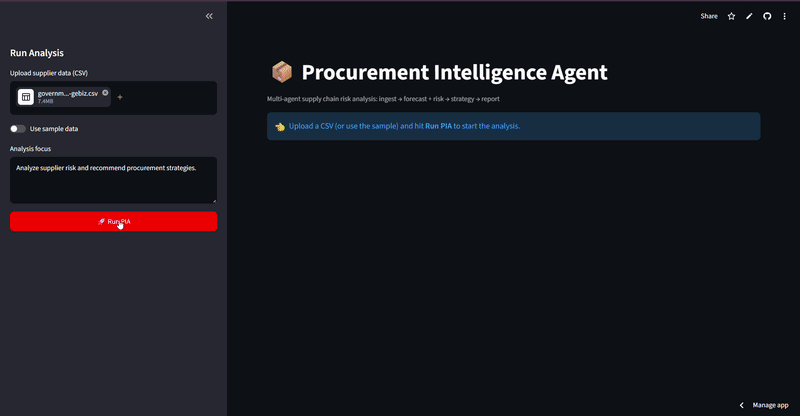

# 📦 Procurement Intelligence Agent (PIA)

**Multi-agent AI system for supply chain risk analysis and procurement strategy generation.**
Built by a procurement professional with 8 years of supplier contract management — this system automates what a strategic sourcing team does when a key supplier starts slipping.


-orange)

## 🎥 Demo



## 🧠 Why this exists

Supply chain disruptions cost enterprises **$184B annually** (Gartner, 2024). Most "AI projects"
are chatbots. PIA is a **decision system**: it ingests supplier order data, forecasts delivery
delays, scores risk, and generates quantified, supplier-specific procurement strategies —
dual-sourcing, buffer stock, renegotiation — with an executive-ready report.

Domain logic comes from real procurement practice: lead-time variance analysis, single-source
dependency scoring, and risk-adjusted cost framing.

## 🏗️ Architecture

```
                        ┌─────────────────────────────────────────┐
                        │           LangGraph Orchestrator        │
                        └─────────────────────────────────────────┘
        ingest → (forecast ∥ risk) → strategy → report

 ┌──────────┐  ┌────────────┐  ┌──────────┐  ┌──────────┐  ┌──────────┐
 │ INGEST   │→ │ FORECAST   │  │ RISK     │→ │ STRATEGY │→ │ REPORT   │
 │ validate │  │ Prophet    │  │ scoring  │  │ LLM      │  │ markdown │
 │ profile  │  │ lead-time  │  │ matrices │  │ (Ollama) │  │ briefing │
 └──────────┘  └────────────┘  └──────────┘  └──────────┘  └──────────┘
      ↓              ↓               ↓             ↓             ↓
  clean.csv    forecast.json    risk.json    strategy.md    report.md
```

## 🚀 Quickstart

```bash
# 1. Install Ollama + pull the model (100% local, free, private)
ollama pull qwen2.5-coder:7b

# 2. Install deps
pip install -r requirements.txt

# 3. Run the dashboard
streamlit run app.py

# 4. Or run headless
python -c "from pia.graph import run_pia; print(run_pia('data/sample_suppliers.csv', 'Analyze supplier risk')['report_md'])"
```

## 🧪 Tests

```bash
pytest -v        # 6/6 in ~2s — LLM fully mocked, no Ollama required
```

## 🗂️ Project Structure

```
pia/
├── agents/          # 5 LangGraph agents
│   ├── ingest.py    # validate, clean, profile
│   ├── forecast.py  # Prophet time-series lead-time prediction
│   ├── risk.py      # risk scoring matrices
│   ├── strategy.py  # LLM strategy generation (single call)
│   └── report.py    # executive markdown briefing
├── graph.py         # LangGraph workflow + streaming runner
├── llm.py           # Ollama backend (local, JSON mode, health check)
├── state.py         # typed graph state
└── config.py        # env-driven settings
app.py               # Streamlit dashboard
tests/               # 6 tests, fully mocked LLM, &lt;2s
```

## 🎯 Key Design Decisions

| Decision | Rationale |
|---|---|
| **Single LLM call** (strategy only) | Forecasting = stats models, not LLM theater. Cheaper, faster, reproducible. |
| **100% local LLM** (Ollama) | Zero API cost; procurement data never leaves the machine. |
| **LangGraph, not a script** | Agents are composable nodes; the graph documents the workflow. |
| **Mocked-LLM tests in &lt;2s** | CI-ready; determinism is a feature, not an afterthought. |

## 🗺️ Roadmap

- [ ] RAG over SOWs / contracts (FAISS + unstructured)
- [ ] ERP connectors (SAP/Oracle via SQLAlchemy)
- [ ] LLM provider fallback (cloud API when Ollama unavailable)

## 🐳 Docker

```bash
docker build -t pia .
docker run -p 8501:8501 -e OLLAMA_BASE_URL=http://host.docker.internal:11434 pia
```
